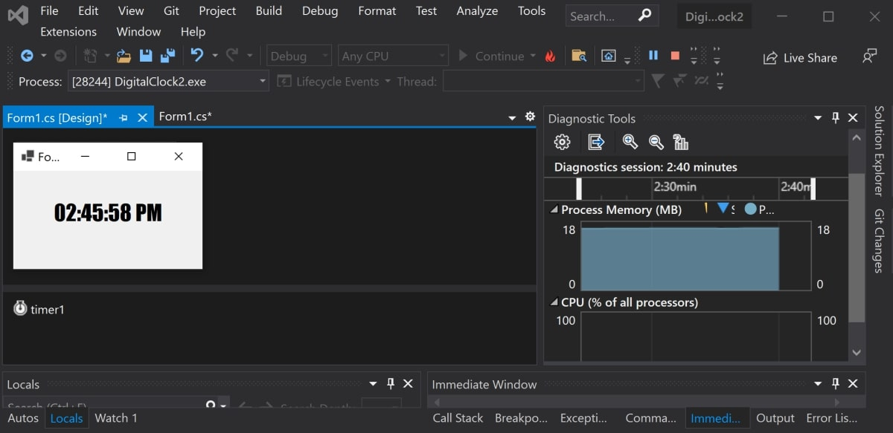

# Digital-Clock-Winforms
This is a Windows Forms application that shows a digital clock that updates every second.

## Prerequisites 

* Make sure you have Visual Studio installed.

## To Run

* Navigate to the DigitalClock folder.
* Click on DigitalClock.sln to open the solution.
* Press the green play button at the top of the Visual Studio window.
* Watch the time update

## Example

